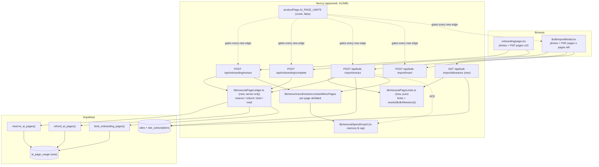

# ai-page-limits: architecture v1

Design version 1, 2026-09-23. Scope: `contract.md` (signed 2026-09-23), AC1–AC11.
Method note: the code-review-graph MCP tools were not available in this session, so the module map
(`.claude/docs/architecture.md`) and the impact radius below come from Grep/Read of the worktree and
read-only queries on the live DB (`wdnruubljlwrduxnvuhr`).

## 1. Summary

Each store gets a durable allowance of AI-read pages, counted in one new Postgres table
(`ai_page_usage`). Pages are reserved by a single atomic RPC before any OpenAI call, and every page
that does not come back `ok` is refunded. Bulk upload is keyed by `(site_id, billing period)`, and the
period is worked out in TypeScript from the same trial/paid rule as `PlanContext`.
Onboarding extract runs before the store exists. It is keyed by a **per-user "open onboarding bucket"**:
one unbound 15-page row per user. `/api/onboarding/complete` binds that row to the new `site_id`, so the
next store gets a fresh 15. A user who never completes can never read more than 15 pages.
Everything sits behind the `AI_PAGE_LIMITS` constant in `productFlags.ts` (default `false`). With it OFF,
no new code path runs. The migration is purely additive (one table, three functions, revoked from public
roles). One contract conflict needs the owner (section 8): the existing onboarding guard test requires
Tamil for any new onboarding error code, but the contract says English only.

## 2. Architecture



### Files

| Path (under `apps/web/`) | Create / modify | Responsibility |
|---|---|---|
| `supabase/migrations/057_ai_page_usage.sql` | create (approved path) | Table, indexes, RLS on with no policies, the three RPCs, and REVOKE EXECUTE from PUBLIC/anon/authenticated (the 055 lesson). |
| `src/lib/platform/productFlags.ts` | modify (approved path) | Add `export const AI_PAGE_LIMITS: boolean = false;`. Nothing else changes. |
| `src/lib/menu/aiPageLimits.ts` | create | Client-safe and pure. Holds `ONBOARDING_PAGE_LIMIT = 15`, `TRIAL_BULK_PAGE_LIMIT = 2`, `PAID_BULK_PAGE_LIMIT = 5` and `BILLING_PERIOD_MS = 30d` (mirrors the literal in `verify-payment`; a drift test reads that file). Exports `resolveBulkAllowance({ siteCreatedAt, storeExpiresAt, now })` → `{ state: 'trial'\|'paid'\|'expired', kind, limit, periodKey, periodEndsAt, resetsAt }` and `planBulkPdf(pages, left)`. |
| `src/lib/menu/aiPageLedger.ts` | create | `import 'server-only'`. Wraps the RPCs: `reserveOnboardingPages(userId, n)`, `reserveBulkPages(userId, siteId, allowance, n)`, `refundPages(bucketId, n)`, `bindOnboardingPages(userId, siteId)`, `readBulkUsage(siteId, allowance)`, `readOnboardingUsage(userId)`. Returns typed results and never throws on a DB error (it returns `{ ok: false, reason: 'unavailable' }` → fail closed). |
| `src/content/aiPageLimits.ts` | create | English copy for the bulk modal and the bulk route (the contract's three "nothing left" strings, "N of M pages left", "this trial" / "this month · resets <date>", and the PDF-too-long message). |
| `src/app/api/bulk-import/allowance/route.ts` | create | GET allowance for the modal (below). |
| `src/app/api/onboarding/extract/route.ts` | modify | Flag ON: a read-only pre-check after eligibility, then an atomic reserve after photo validation and before the extraction, and a refund of non-`ok` pages in `finally`. |
| `src/app/api/onboarding/complete/route.ts` | modify | Flag ON: after products insert successfully, call `bindOnboardingPages(userId, site.id)` (best effort, logged). |
| `src/app/api/bulk-import/extract/route.ts` | modify | Flag ON: `aiSpendAllowed(userId)` (AC9), `X-Site-Id` ownership + allowance, reserve, `extractMenuPages` with `spendKey`, refund, and a `pages` block in the response. |
| `src/app/api/bulk-import/insert/route.ts` | modify | Flag ON: skip `reserveQuota` on `bulk_import_usage` (the contract says it stops being the gate), add `aiSpendAllowed(userId)`, and record description-call spend with `recordAiUsage(..., userId)`. Flag OFF: byte-for-byte today's path. |
| `src/app/onboarding/scanMessages.ts` | modify | `PAGE_LIMIT` and `PAGE_LIMIT_UNAVAILABLE` entries (en + ta; see Q1). Add both to `SKIPPABLE_CODES`. Add `pageLimitMessage(left)`. |
| `src/app/onboarding/page.tsx` | modify | On `PAGE_LIMIT`: show the message with `pagesLeft`, cap photo/PDF slots to `pagesLeft`, and keep "Skip and add by hand" visible. The idle screen stays "up to 15 pages" as today. |
| `src/components/manage/BulkImportModal.tsx` | modify | `if (AI_PAGE_LIMITS)` branch: fetch the allowance, show "N of M pages left", `accept="image/*,application/pdf"`, expand PDFs via `pdfToPageImages(file, min(5 − picked, left))`, send `X-Site-Id` + `X-Photo-Count`, and show the three exhausted states with the `/manage/subscription` link. The OFF branch keeps today's JSX and today's `bulk_import_usage` read. |
| `tests/unit/aiPageLimits.test.ts` | create | Pure resolver and PDF planning. |
| `tests/acceptance/ai-page-limits.test.ts` | create | AC1–AC9 and AC11 route behaviour, flag mocked ON. |
| `tests/acceptance/ai-page-limits-flag-off.test.ts` | create | AC10 backward-compat, flag mocked OFF explicitly. |
| `tests/security/aiPageLimitsAbuse.test.ts` | create | 20-concurrent, ownership, and migration least-privilege source checks. |
| `tests/e2e/ai-page-limits.spec.ts` | create | Modal states and PDF refusal (Playwright, run on the flag-ON release commit). |

Not touched: `src/lib/payments/**`, `src/lib/auth/**`, `middleware.ts`, `.do/`, `storeEligibility.ts`,
`PlanContext.tsx`, `menuExtractor.ts`, `pdfPages.ts`, `aiSpendGuard.ts`, `product-inventory/page.tsx`
(it already passes `siteId` to the modal).

### New route

`GET /api/bulk-import/allowance?siteId=<uuid>`. Auth: `Authorization: Bearer <Firebase ID token>`, and the site must belong to the caller.
- 401 `{ error: 'Unauthorized' }` / `{ error: 'Invalid token' }`. 400 `{ error: 'siteId required' }`. 404 `{ error: 'Site not found' }` when the site is missing or not the caller's (AC11; same wording as `insert`).
- 503 `{ error: 'Could not check your AI pages. Please try again.', code: 'PAGE_LIMIT_UNAVAILABLE' }`.
- 200, flag OFF: `{ success: true, enforced: false }` (the modal never calls it while OFF).
- 200, flag ON: `{ success: true, enforced: true, state: 'trial'|'paid'|'expired', limit, used, left, resetsAt: string|null }`.

### Changed request/response contracts (flag ON only)

| Route | Request change | New refusals | Success adds |
|---|---|---|---|
| `POST /api/onboarding/extract` | none (`X-Photo-Count` already sent) | 403 `{ code: 'PAGE_LIMIT', error, pagesLeft, pageLimit: 15 }`; 503 `{ code: 'PAGE_LIMIT_UNAVAILABLE', error }` | `pages: { used, limit: 15, left }` |
| `POST /api/bulk-import/extract` | header `X-Site-Id` (required when ON), header `X-Photo-Count` (hint) | 400 `{ code: 'SITE_REQUIRED' }`; 404 `{ error: 'Site not found' }`; 429 `{ code: 'DAILY_SCAN_LIMIT' }` (AC9); 403 `{ code: 'PAGE_LIMIT', state, pagesLeft, pageLimit, resetsAt }`; 503 `{ code: 'PAGE_LIMIT_UNAVAILABLE' }` | `pages: { state, used, limit, left, resetsAt }`, `failedPhotos: number[]` |
| `POST /api/bulk-import/insert` | none | 429 `{ code: 'DAILY_SCAN_LIMIT' }` (per-user $ cap) | none |

`siteId` travels in a header rather than a form field. The pre-check can then refuse before `request.formData()` buffers the body, which keeps the "size and cheap gates before buffering" order that `aiCostAbuse.test.ts` guards.

### Gate order (flag ON)

Onboarding extract, inserted into the existing numbered path:
- **4b** (after eligibility, before token/memory admission): `readOnboardingUsage(userId)`. If `left == 0`, or `X-Photo-Count > left`, return 403 `PAGE_LIMIT`. This is a cheap early refusal, not the gate.
- **9b** (after magic-byte validation, before step 10): `reserveOnboardingPages(userId, validated.length)`. `ok:false/limit` → 403 `PAGE_LIMIT` with the true `pagesLeft`. `unavailable` → 503 `PAGE_LIMIT_UNAVAILABLE`. **This atomic reservation is the gate (AC1, AC5).**
- **finally**: `refundPages(bucketId, reserved − okPages)`. `okPages` is the number of `report.pages` with `status === 'ok'`, or 0 if extraction threw. A client abort makes the extractor abandon queued pages as `failed`, and those are refunded (the contract's abort edge case). A guard flag makes sure the refund runs exactly once.
- Queued refusals (BUSY / SCAN_IN_PROGRESS / RATE_LIMITED) all happen before 9b, so a waiting owner holds no pages.

Bulk extract (flag ON): auth → global spend → **per-user spend (AC9)** → rate limit → content-length →
`X-Site-Id` + site read (`id, created_at, site_subscriptions(store_expires_at)` with `.eq('user_id', userId)`, AC11) →
`resolveBulkAllowance` → pre-check → admission → bounded parse → validation → **reserve** → `extractMenuPages(images, { signal, spendKey: userId })`
→ the OCR fallback runs unchanged when there are 0 items → refund in `finally`.

### Refund rule
Refunded pages = reserved − pages whose `PageReport.status === 'ok'`. A page that is `ok` with 0 items stays counted, as AC6 says literally. When the OCR fallback produces items, nothing extra is charged: those pages are already counted or refunded by their Pass-1 status.

### Onboarding key (why a per-user open bucket)
- **Rule:** at most one *unbound* onboarding row per user (enforced by a unique partial index). Extract always draws from it. `/complete` binds it to the store it just created. The next `/onboarding` visit then opens a fresh 15-page row, which is "15 per store" in practice.
- **It stops endless re-runs.** Retrying, refreshing or abandoning never creates a second unbound row, so a user who never completes is capped at 15 pages for life.
- **It needs nothing from the client.** No token is carried across the phase machine, so the highest-abandonment screen gets no new plumbing and no new failure mode.
- **It stays tied to eligibility.** A new bucket only opens once a store has been created, and store creation is already bounded by `checkStoreEligibility` (2 trial stores at once, 5 total) plus `/complete`'s 5/hour limit.
- **Binding is best effort.** If the bind fails, the row stays unbound and the next store shares what is left. The owner gets fewer pages, never more.

### Billing period (AC4)
`E = store_expires_at`. When `E > now`, the store is paid. The period is the 30-day slice of `(…, E]` that contains now:
`k = ceil((E − now) / 30d) − 1`, `periodEnd = E − k·30d`, `periodKey = 'paid:' + periodEnd.toISOString()`, and `resetsAt = periodEnd`.
- A monthly payment makes `periodEnd = E`, the payment anniversary.
- An **early renewal** (E jumps +30d mid-period) gives the *same* key, so it cannot be used to reset pages. The next slice starts at the old E.
- **Precedence** is the `PlanContext` rule: paid, then trial (`created_at + 7d > now`, `periodKey 'trial'`, never resets), then expired (limit 0). A store paid during its trial therefore uses paid rules. A lapsed store is expired. A missing `site_subscriptions` row counts as not paid (about 25 of the 60 sites have none). A null `created_at` counts as trial ended.

### Data model (details in section 4)
- `ai_page_usage(id, kind, user_id, site_id, period_key, period_ends_at, pages_used, pages_refunded, page_limit, created_at, updated_at, bound_at)`.
- RPCs: `reserve_ai_pages`, `refund_ai_pages`, `bind_onboarding_pages`. They are callable by service_role only.

### Env vars, external calls, flag
- **Env vars:** none new.
- **External calls:** none new. The same gpt-4o, gpt-4o-mini and embedding calls, now bounded per store.
- **Flag:** `AI_PAGE_LIMITS` is a constant `false` in `productFlags.ts`, following the repo's `ORDERING_FROZEN` pattern. It is client-safe, so the modal reads it directly.
- **Go-live:** a one-line commit flips it to `true`. The phase-5 QA runs on that commit, and it gets the release tag. Rolling back to `previous_tag` removes the flag automatically.
- **Tests:** they must mock the flag explicitly in both states (the `paymentAttacks` pattern) and never rely on the default, so both suites stay valid after the flip.

### Design decisions taken (owner confirms at the design gate; they are not blocking)
- **D1. AC9 is behind the flag.** With the flag OFF, AC10 then holds literally. Go-live turns the flag ON for everyone, so AC9 goes live on the same day. There is no cost to waiting, because the flag-OFF state is exactly today's.
- **D2. `/insert` with the flag ON** no longer reserves `bulk_import_usage`, as the contract says. So that the endpoint does not become an unmetered description generator, it gets the per-user $ cap and spend recording instead. A legit owner cannot reach $1/day on inserts.
- **D3. No FK from `ai_page_usage.site_id` to `sites`.** Store deletion happens in the browser (`settings/page.tsx` → `sites.delete()`). A RESTRICT FK would break it, and SET NULL would collide with the unique open-bucket index. The rows stay as an audit ledger (a few rows per store).
- **D4. Bulk extract uses `extractMenuPages` when ON.** `extractMenuItemsFromImages` is already a thin wrapper over it, so the AI calls are identical. With the flag OFF, the old call stays exactly as it is.

## 3. Existing-user impact map

Live counts (2026-09-23): 60 sites / 32 owners. **4 stores are paid now, 3 are in trial, and 53 have an ended trial and are unpaid.**
Only **4 users have ever used bulk import** (7 `bulk_import_usage` day-rows; max 11 units in a day).
Everything below describes the state with the flag **ON**. With it OFF, every row is "unchanged".

| Flow | Bucket | Who is affected | What they will see | Mitigation |
|---|---|---|---|---|
| Onboarding scan, first attempt | unchanged | New owners, and owners adding a store | Same screen, "up to 15 pages", same results | The reservation is ≤15 and the scan is ≤15, so a first scan can never be refused. |
| Onboarding re-scan before launch | changed | New owners who scan, go back and scan again | Today they can re-scan up to 10/hour. Now the re-scans share the 15 pages. When pages run out they see "You've used this store's 15 AI pages…" with pages left, plus "Skip and add by hand" | Failed pages are refunded. `PAGE_LIMIT` is skippable. After launch they can add dishes by hand or with bulk upload. |
| Onboarding complete / launch | changed (invisible) | Every new store | Nothing visible. One extra DB update binds the bucket | Best effort. On failure, launch still succeeds. |
| Bulk upload, paid stores | changed | 4 paid stores | Today: 15 work units per day. Now: "N of 5 pages left · this month · resets <date>". When used up: "Monthly pages used. Resets on <date>" | Owner-approved in the contract. Counters start at 0 at go-live. Add by hand stays visible. |
| Bulk upload, trial stores | changed | 3 stores in trial now, plus every new trial | Today: 15/day. Now: 2 pages for the whole trial. When used: "Trial pages used. Pay ₹299 for 5 pages every month" | Contract AC2. Onboarding's 15 pages is the main path for a trial menu. |
| Bulk upload, expired unpaid stores | changed | 53 stores (their owners can still log in and edit) | Today: works. Now: 0 pages, "Your trial has ended. Pay ₹299 to use AI upload" with a link to `/manage/subscription` | Contract AC3. Manual add and edit are untouched. Only 4 users have ever used bulk import. |
| Bulk upload accepts PDF | changed (added) | Every store with pages left | The picker accepts PDFs. Each page counts as one. A PDF longer than what is left is refused in the browser | The server's reservation is the backstop. `MAX_PHOTOS = 5` stays. |
| Bulk extract per-user $ cap (AC9) | changed | Only an account that spends over $1/day in one process | 429 "today's scanning limit" | A legit owner cannot reach it: 5 pages is about $0.05–0.10. |
| Bulk insert (descriptions, image match, tiers) | changed (gate only) | Anyone importing | The same items and images. The "photos used today" wording is gone | The page allowance replaces the daily quota. The per-user $ cap backs it up (D2). |
| `bulk_import_usage` table | unchanged schema | none | none | Expand-only. It stops being written while ON and is kept for rollback. |
| Manual item add / edit / delete | unchanged | All owners | none | No file in that path is touched. |
| Store deletion (Settings) | unchanged | Owners deleting a store | none | No FK to `sites` (D3). |
| AI food photos / image matching | unchanged | none | none | Out of scope. |
| **Critical 1**: QR menu scan (`/shop/[slug]`) | unchanged | none | none | No shop code is touched. |
| **Critical 2**: Login / OTP | unchanged | none | none | No auth code is touched. |
| **Critical 3**: Dashboard loads | unchanged | none | none | The modal fetches its allowance only when opened. The dashboard pages are untouched. |
| **Critical 4**: Menu edit | unchanged | none | none | none |
| **Critical 5**: Sold-out toggle | unchanged | none | none | none |
| **Critical 6**: Subscription path | unchanged | none | Only a new link *to* `/manage/subscription` | `src/lib/payments/`, `subscription/*` and `webhooks/*` are not touched. |
| **Critical 7**: `/api/version` | unchanged | none | none | none |

## 4. Migration plan

File: `apps/web/supabase/migrations/057_ai_page_usage.sql`. Applied with Supabase `apply_migration`, which asks the owner.

```sql
-- 057_ai_page_usage.sql — durable AI page allowance per store (ai-page-limits).
-- Expand-only: one new table and three new functions. Nothing existing is altered.

CREATE TABLE IF NOT EXISTS public.ai_page_usage (
  id              uuid PRIMARY KEY DEFAULT gen_random_uuid(),
  kind            text NOT NULL CHECK (kind IN ('onboarding','bulk_trial','bulk_paid')),
  user_id         text NOT NULL,                 -- Firebase uid of the owner (sites.user_id is text)
  site_id         uuid NULL,                     -- NULL = onboarding bucket not yet bound. No FK (D3).
  period_key      text NOT NULL DEFAULT '',      -- '' | 'trial' | 'paid:<period end ISO>'
  period_ends_at  timestamptz NULL,
  pages_used      integer NOT NULL DEFAULT 0 CHECK (pages_used >= 0),
  pages_refunded  integer NOT NULL DEFAULT 0 CHECK (pages_refunded >= 0),
  page_limit      integer NOT NULL CHECK (page_limit >= 0),   -- limit when the row was opened (audit)
  created_at      timestamptz NOT NULL DEFAULT now(),
  updated_at      timestamptz NOT NULL DEFAULT now(),
  bound_at        timestamptz NULL
);

-- One open onboarding bucket per user: the property that stops endless re-scans.
CREATE UNIQUE INDEX IF NOT EXISTS ai_page_usage_open_onboarding
  ON public.ai_page_usage (user_id) WHERE kind = 'onboarding' AND site_id IS NULL;
-- One bulk row per store per period.
CREATE UNIQUE INDEX IF NOT EXISTS ai_page_usage_bulk_period
  ON public.ai_page_usage (site_id, kind, period_key) WHERE kind <> 'onboarding' AND site_id IS NOT NULL;
CREATE INDEX IF NOT EXISTS ai_page_usage_user ON public.ai_page_usage (user_id);

ALTER TABLE public.ai_page_usage ENABLE ROW LEVEL SECURITY;   -- no policies: service_role only
REVOKE ALL ON public.ai_page_usage FROM anon, authenticated;

-- Reserve p_pages or refuse. The single conditional UPDATE is the atomic check-and-charge (AC5):
-- concurrent callers serialise on the row lock, and READ COMMITTED re-checks the WHERE clause
-- against the committed value, so N callers can never pass pages_used + p_pages <= p_limit together.
CREATE OR REPLACE FUNCTION public.reserve_ai_pages(
  p_user_id text, p_kind text, p_site_id uuid, p_period_key text,
  p_period_ends_at timestamptz, p_limit integer, p_pages integer)
RETURNS TABLE (ok boolean, reason text, bucket_id uuid, pages_used integer, page_limit integer)
LANGUAGE plpgsql SET search_path = public AS $$
DECLARE v_id uuid; v_used integer;
BEGIN
  IF p_pages < 1 OR p_limit < 0 THEN RAISE EXCEPTION 'reserve_ai_pages: bad arguments'; END IF;

  IF p_kind = 'onboarding' THEN
    INSERT INTO ai_page_usage (kind, user_id, page_limit) VALUES ('onboarding', p_user_id, p_limit)
      ON CONFLICT (user_id) WHERE kind = 'onboarding' AND site_id IS NULL DO NOTHING;
    SELECT u.id INTO v_id FROM ai_page_usage u
      WHERE u.kind = 'onboarding' AND u.user_id = p_user_id AND u.site_id IS NULL;
  ELSE
    -- AC11, defence in depth: the route checks ownership too.
    IF NOT EXISTS (SELECT 1 FROM sites s WHERE s.id = p_site_id AND s.user_id = p_user_id) THEN
      RETURN QUERY SELECT false, 'not_owner'::text, NULL::uuid, 0, 0; RETURN;
    END IF;
    INSERT INTO ai_page_usage (kind, user_id, site_id, period_key, period_ends_at, page_limit)
      VALUES (p_kind, p_user_id, p_site_id, p_period_key, p_period_ends_at, p_limit)
      ON CONFLICT (site_id, kind, period_key) WHERE kind <> 'onboarding' AND site_id IS NOT NULL DO NOTHING;
    SELECT u.id INTO v_id FROM ai_page_usage u
      WHERE u.site_id = p_site_id AND u.kind = p_kind AND u.period_key = p_period_key;
  END IF;

  UPDATE ai_page_usage u SET pages_used = u.pages_used + p_pages, updated_at = now()
    WHERE u.id = v_id AND u.pages_used + p_pages <= p_limit
    RETURNING u.pages_used INTO v_used;
  IF FOUND THEN
    RETURN QUERY SELECT true, 'ok'::text, v_id, v_used, p_limit;
  ELSE
    RETURN QUERY SELECT false, 'limit'::text, v_id, (SELECT u.pages_used FROM ai_page_usage u WHERE u.id = v_id), p_limit;
  END IF;
END $$;

CREATE OR REPLACE FUNCTION public.refund_ai_pages(p_bucket_id uuid, p_pages integer)
RETURNS integer LANGUAGE sql SET search_path = public AS $$
  UPDATE ai_page_usage SET pages_used = GREATEST(0, pages_used - p_pages),
         pages_refunded = pages_refunded + LEAST(p_pages, pages_used), updated_at = now()
   WHERE id = p_bucket_id AND p_pages > 0
  RETURNING pages_used;
$$;

CREATE OR REPLACE FUNCTION public.bind_onboarding_pages(p_user_id text, p_site_id uuid)
RETURNS void LANGUAGE sql SET search_path = public AS $$
  UPDATE ai_page_usage SET site_id = p_site_id, bound_at = now(), updated_at = now()
   WHERE kind = 'onboarding' AND user_id = p_user_id AND site_id IS NULL
     AND EXISTS (SELECT 1 FROM sites s WHERE s.id = p_site_id AND s.user_id = p_user_id);
$$;

REVOKE EXECUTE ON FUNCTION public.reserve_ai_pages(text, text, uuid, text, timestamptz, integer, integer) FROM PUBLIC, anon, authenticated;
REVOKE EXECUTE ON FUNCTION public.refund_ai_pages(uuid, integer) FROM PUBLIC, anon, authenticated;
REVOKE EXECUTE ON FUNCTION public.bind_onboarding_pages(text, uuid) FROM PUBLIC, anon, authenticated;
GRANT  EXECUTE ON FUNCTION public.reserve_ai_pages(text, text, uuid, text, timestamptz, integer, integer) TO service_role;
GRANT  EXECUTE ON FUNCTION public.refund_ai_pages(uuid, integer) TO service_role;
GRANT  EXECUTE ON FUNCTION public.bind_onboarding_pages(text, uuid) TO service_role;
-- Rollback (a later release, only once no deployed code calls them): DROP FUNCTION …; DROP TABLE public.ai_page_usage;
```

**Why this is expand-only:** it adds a new table, new indexes on that table and new functions. No existing
table, column, grant, policy or function is dropped, renamed, narrowed or rewritten. There is no backfill:
counters start at 0 at go-live, as the contract says.

**The previous release still runs on it:** the previous release never references `ai_page_usage` or the
new RPCs, and `bulk_import_usage` is untouched, so a code rollback to `previous_tag` runs unchanged.

**Safe to apply before deploy:** the migration can be applied before the new code deploys, because nothing
reads the new objects until the flag is ON. Store deletion is unaffected (no FK).

## 5. Backward-compatibility tests required

All of these go in `tests/acceptance/ai-page-limits-flag-off.test.ts` with
`vi.mock('@/lib/platform/productFlags', … AI_PAGE_LIMITS: false)`. They mock the flag explicitly, so they
stay valid after the go-live flip.

| Changed flow | Test proving identical behaviour with the flag OFF |
|---|---|
| Onboarding extract | Two consecutive 15-photo scans for the same user both return 200 with the same body shape as today (no `pages` key). The Supabase fake records **zero** `rpc()` calls and zero `ai_page_usage` access. `aiSpendAllowed` is called exactly as today. `resilient-extraction.test.ts` and `onboardingCrash.test.ts` stay green unchanged. |
| Onboarding complete | A successful launch makes no `bind_onboarding_pages` RPC call, and the response body is unchanged. `onboarding-gate`, `post-otp-handoff` and `post-auth-destination` stay green. |
| Bulk extract | A request **without** `X-Site-Id` returns 200 with `{ success, items, photosProcessed }` only. `aiSpendAllowed` is called once, with **no** userId argument. `extractMenuItemsFromImages` is used without `spendKey`. There are no RPC calls. A PDF-page count above the allowance is not checked. |
| Bulk insert | The whole existing `tests/security/aiCostAbuse.test.ts` "Finding 3" block is re-run with the flag OFF, and `bulk_import_usage` is reserved by CAS before the first OpenAI call as today. There is no `aiSpendAllowed(userId)` refusal. |
| Bulk modal | A source-level test (node env, no DOM library) asserts that the OFF branch still reads `bulk_import_usage` with `currentDay()`, keeps `accept="image/*"`, keeps the "photos used" / "Daily limit reached" copy, and never calls `/api/bulk-import/allowance`. The ON-only elements (`application/pdf`, `X-Site-Id`) appear only inside `AI_PAGE_LIMITS` branches. |
| Allowance route | With the flag OFF it returns `{ success: true, enforced: false }` without querying the DB. |

### Test plan per acceptance criterion (flag mocked ON)

| AC | Test (file) |
|---|---|
| AC1 | `ai-page-limits.test.ts`: (a) a fresh user scans 15 photos → 200 with `pages.left 0`. (b) With a bucket at 13 used, a 3-photo scan → 403 `PAGE_LIMIT`, `pagesLeft: 2`, and the OpenAI fake is never called. (c) `X-Photo-Count: 5` with 2 left → 403 before `formData()` is read. (d) A user who never completes: repeated scans are always drawn from the same bucket, and the 16th page is refused. (e) After `/complete` binds, a new scan opens a new 15. |
| AC2 | `aiPageLimits.test.ts`: a site created 2 days ago with no sub → `{ state:'trial', limit:2, periodKey:'trial' }`, and the same key at day 6 (never resets). Route: a 3rd page in the trial → 403 `PAGE_LIMIT` `state:'trial'`. |
| AC3 | Resolver: created 8 days ago and not paid → `{ state:'expired', limit:0 }`. Route: 403 `PAGE_LIMIT` `state:'expired'` before the body is read, with no AI. Copy test: the expired view model has the text "Pay ₹299" and href `/manage/subscription`, and the "add by hand" action is present. |
| AC4 | Resolver: E = now+10d → `resetsAt = E`. E = now+40d (early renewal) → `resetsAt = E−30d`, and the key equals the pre-renewal key. E = now−1s with the trial over → expired. Paid during trial → paid wins. Drift test: `verify-payment/route.ts` source still contains `30 * 24 * 60 * 60 * 1000`. |
| AC5 | `aiPageLimitsAbuse.test.ts`: 20 concurrent bulk extracts of 1 page each on a paid store, against a fake RPC that applies the conditional update serially → exactly 5 succeed, 15 get `PAGE_LIMIT`, and OpenAI is called 5 times. A source test on `057_*.sql`: the counter changes only through `UPDATE … WHERE … pages_used + p_pages <= p_limit`, and the route files contain no read-then-write of `pages_used`. A reservation is recorded in the call timeline before the first OpenAI call. |
| AC6 | Fake extractor returns 3 pages with 1 `failed` → `refund_ai_pages(bucket, 1)`. The extractor throws after reserve → full refund. An aborted signal makes queued pages `failed` → refunded. The refund is called exactly once per request. |
| AC7 | Source test: `aiPageLedger.ts` holds no module-level counters (no `Map`/`let` state) and goes through `supabaseServer.rpc`. Test: `vi.resetModules()` between two requests (a simulated restart) and the fake DB state still refuses the over-limit request. |
| AC8 | `aiPageLimits.test.ts`: `planBulkPdf(4, 2)` → refused with the "has 4 pages, only 2 left" message. Source test: the ON branch uses `accept="image/*,application/pdf"` and `pdfToPageImages(file, min(5 − picked, left))`. Route backstop: 5 page JPEGs with 2 left → 403 `PAGE_LIMIT`. E2E (`ai-page-limits.spec.ts`): pick a 3-page PDF with 2 left → the refusal message, and no request is sent. |
| AC9 | Flag ON, `aiSpendAllowed(userId)` false → 429 `DAILY_SCAN_LIMIT`, with no reservation and no AI. `extractMenuPages` is called with `spendKey: userId`. |
| AC10 | Section 5 table above. |
| AC11 | Bulk extract with another user's `X-Site-Id` → 404, no RPC reserve and no AI. The RPC fake returns `not_owner` → the route answers 404. The allowance GET for another user's site → 404. `bind_onboarding_pages` with another user's site does nothing (SQL `EXISTS` guard; source test). |

## 6. Resource footprint (estimate)

Prices: gpt-4o $2.50 / $10 per 1M tokens (input/output), gpt-4o-mini $0.15 / $0.60, ₹95.7/USD.
Per page the brief gives ~1,555 input tokens and 600–1,500 output tokens.
- Per page (typical): $0.00389 input plus $0.006–$0.015 output = **$0.0099–$0.0189 ≈ ₹0.95–₹1.81**.
- Pass-2 descriptions (gpt-4o-mini, ~50 items per batch, ~2.5k in and ~1.8k out) ≈ $0.0014 ≈ **₹0.14 per batch**. One or two batches per import.
- Pathological page (dense page that hits the 2,500-token cap, then a 5,000-token retry): 2×1,555 in plus 7,500 out ≈ $0.083 ≈ **₹7.9 per page**. The per-scan 45k output budget caps it.

| Store state | Pages allowed | AI ₹ typical | AI ₹ worst case | vs ₹15/shop/month ceiling |
|---|---|---|---|---|
| Paid, per billing month | 5 | ₹4.7–₹9.0, plus ≤₹0.3 descriptions → **≈₹5–₹9.4** | ₹39.6 (all 5 pages pathological) | Typical is **within** the ceiling. The worst case needs 5 max-density pages in one month and is unlikely. Business QA to price. |
| Trial, lifetime (one-off, not monthly) | 15 onboarding + 2 bulk = 17 | ₹16.1–₹30.7 (a median store of about 19 items is 1–3 pages → ≈₹1–₹5.5) | ≈₹134 (17 pathological pages) | This is acquisition cost, not the monthly ceiling. |
| Expired unpaid | 0 | ₹0 | ₹0 | none |
| New paid store, first month | onboarding (already spent in trial) + 5 | as for paid | as for paid | none |

**Refund-loop exposure.** A page that costs tokens and still fails (reason `truncated` or `rejected`) is
refunded and can be retried. The new column `pages_refunded` makes this visible. It is bounded by the
per-user $1/day in-memory cap (AC9, about ₹96/day per process), the bulk rate limit of 20/hour and the
onboarding rate limit of 10/hour. See risk R2.

**Memory per request:** unchanged. Onboarding stays at about 7× the upload, at most about 84MB for 15×800KB.
Bulk stays at most about 70MB for a 10MB body. The ledger adds 1–3 small PostgREST calls (a few KB), and
the allowance GET needs under 1MB. PDF rendering stays in the browser.

**DB rows and storage per shop per month:** a paid store adds 1 row a month. A trial store has 1 row for
life. Onboarding has 1 row per store, plus at most 1 unbound row per user. Each row is about 200B plus
indexes, so the whole platform (60 stores) adds under 100 rows and under 50KB a year.

**Queries added:** onboarding extract +2–3 (pre-check, reserve, refund), `/complete` +1, bulk extract +4
(site read, pre-check, reserve, refund), and each modal open +2.

**External API calls per shop per month:**

| Store state | gpt-4o page calls | Other calls |
|---|---|---|
| Paid | ≤5 (plus ≤1 retry each, and a gpt-4o-mini fallback on 429/5xx) | 1–2 gpt-4o-mini description batches per import, 1 embedding call per insert |
| Trial | ≤17 for life | none |
| Expired | 0 | 0 |

No new external service, queue or paid API.

## 7. Risks and alternatives considered

### Risks
- **R1: churn by deleting and recreating stores.** Each newly created store opens a fresh 15 onboarding pages. An owner could launch, delete and relaunch. What bounds it: eligibility (2 trial stores at once, 5 total), `/complete` at 5/hour, and the per-user $1/day in-memory cap. The ledger keeps bound rows after deletion (no FK), so business QA can query pages per user. A per-user lifetime onboarding ceiling is possible as a follow-up, but it is outside this contract.
- **R2: a refund loop on pages that cost tokens but still fail.** See section 6. `pages_refunded` is recorded, and a refund cap (for example 3× the limit per bucket) is a cheap follow-up if business QA sees it happen. It is not built now, because it would break AC6 for legit retries.
- **R3: a crash mid-request leaks the reservation.** The pages stay counted without being read. This fails closed: no extra spend, and the owner loses up to 5 or 15 pages. Support can fix it with one `UPDATE` (the owner runs it, since the DB is read-only to Claude). The chance is low, since the admission layer keeps the instance from running out of memory.
- **R4: an `ok` page with 0 items stays counted (AC6 as written).** A trial owner who uploads 2 food photos instead of a printed menu could lose both pages. Mitigation in copy: the modal says "Upload photos of your printed menu".
- **R5: onboarding copy language (Q1).** `resilient-extraction.test.ts:497` fails unless every `code:` the onboarding extract route emits has a Tamil (`஀–௿`) `ta` entry. The contract says English only. Tests must not be edited, and emitting `PAGE_LIMIT` through a constant to dodge the regex would be gaming the guard.
- **R6: the flag is a constant.** Go-live is a commit, and E2E for the ON state must run on that commit. Rollback by tag removes the flag. The kill switch is a revert and redeploy of about 5 minutes. That is accepted, because it matches `ORDERING_FROZEN` and fails safe to today's behaviour.
- **R7: the AC9 and per-user caps are in memory and reset on every deploy.** This is an existing limitation. The page allowance itself is durable (AC7), and it is now the primary bound.
- **R8: 53 expired stores lose AI bulk upload.** This is contract-approved. Actual exposure is small: 4 users have ever used bulk import.

### Alternatives considered

| # | Alternative | Why it was rejected |
|---|---|---|
| A1 | A per-user onboarding counter (for example 15 × the number of eligible store slots) | The contract says "per store". Slot arithmetic drifts when stores are deleted or trials lapse. It also either blocks a legit second store or leaves extra pages unused. |
| A2 | A reservation token handed to the client and presented to `/complete` | The client can drop the token and ask for a new one, so the server would still need "one open bucket per user". That rule is the whole mechanism, and the token only adds plumbing and a new failure mode to the highest-abandonment screen. |
| A3 | Reuse `bulk_import_usage` (with `month` as the period key and a site id in `user_id`) | It overloads a live table's meaning (a text `user_id` holding a site id). The OFF-path code reads and writes the same table, which risks the rollback. The modal reads it with the anon key. It also keeps the 5-attempt CAS loop, which returns 503 to legit users when 20 requests arrive at once. |
| A4 | A TS compare-and-swap loop with no migration | It is not durable per store without a table anyway. Under the AC5 load the CAS loses and retries. A migration is approved, and a single conditional `UPDATE` is simpler and provably atomic. |
| A5 | Computing trial/paid/period inside the SQL function | It would put the 7-day trial rule in a fourth place. The TS resolver is shared by the route, the allowance GET and the modal, and has unit tests. The SQL only counts and checks ownership. |
| A6 | Making the flag an env var (`NEXT_PUBLIC_AI_PAGE_LIMITS`) | It would allow E2E with the flag ON without a commit, but go-live would then need a DO console or `.do/` change (a protected path, not approved), and rollback by tag would not revert it. The constant keeps go-live and rollback inside git. |

## 8. Questions for the owner

- **Q1. Tamil for the two onboarding refusal messages?** The contract says new messages are English only.
  But `tests/acceptance/resilient-extraction.test.ts` (which must not be edited) fails unless every error
  code the onboarding scan route returns also has a Tamil message. The onboarding area rules also require
  Tamil + English.
  - **Recommendation:** add Tamil only for the two onboarding codes, `PAGE_LIMIT` ("this store's 15 AI pages are used") and `PAGE_LIMIT_UNAVAILABLE` ("could not check your pages, try again"). Claude drafts them and you approve them with the rest of the copy at this gate. The bulk-upload modal stays English only, as the contract says.
  - **The alternative:** keep English only, which means changing that guard test. That needs your explicit instruction, because the hard rules forbid editing tests to make them pass.
  - A one-word answer ("Tamil OK" or "edit the test") unblocks the build. Nothing else in this design depends on the answer.

VERDICT: STOP-FOR-OWNER
